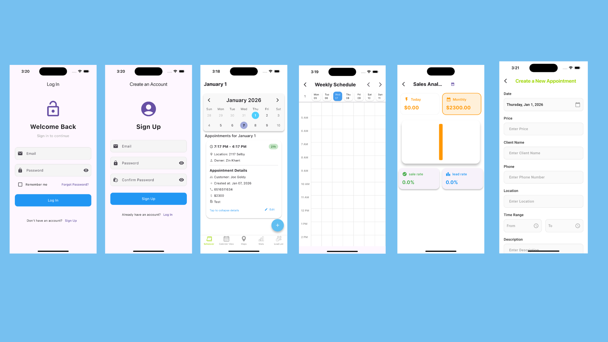

# Knox CRM

<div align="center">
  
</div>

A Flutter-based Customer Relationship Management (CRM) application for field sales and service businesses. Manage leads, schedule appointments, track sales analytics, and visualize customer locations on interactive maps.

## Features

### Authentication

- Email/Password authentication via Firebase
- Session management with persistent login
- User-specific data isolation
- Password recovery

### Lead Management

- Create and track customer leads
- Status management: New, Quoted, Got Contact, Next Year
- Filter leads by status
- Store contact details (name, email, phone, notes)
- Convert leads to appointments

### Appointment Scheduling

- Two-week calendar view with visual markers
- Weekly schedule view with hourly timeline (4 AM - 10 PM)
- Create, edit, and delete appointments
- Swipe-to-delete functionality
- Real-time synchronization with Firestore

### Sales Analytics

- Revenue tracking (daily and monthly)
- Conversion rate monitoring
- Interactive charts using FL Chart
- Date range filtering

### Maps Integration

- Google Maps visualization of customer locations
- Custom markers for leads, sales, no response, and rejections
- Location-based management and route planning

### User Interface

- Material Design 3
- Custom Google Fonts
- Responsive design
- Bottom navigation with 5 sections: Scheduler, Calendar View, Maps, Stats, Lead List

## Technology Stack

- **Framework**: Flutter 3.7+, Dart SDK
- **Backend**: Firebase (Authentication, Firestore)
- **Maps**: Google Maps Flutter, Geolocator
- **UI Libraries**: Table Calendar, Calendar View, FL Chart, Google Fonts

## Dependencies

```yaml
dependencies:
  flutter:
    sdk: flutter
  cupertino_icons: ^1.0.8
  intl: ^0.20.2
  firebase_core: ^3.13.0
  firebase_auth: ^5.5.3
  cloud_firestore: ^5.6.7
  table_calendar: ^3.2.0
  calendar_view: ^1.4.0
  google_fonts: ^6.2.1
  flutter_spinkit: ^5.2.1
  fl_chart: ^0.71.0
  google_maps_flutter: ^2.12.1
  geolocator: ^14.0.0
  flutter_launcher_icons: ^0.14.3
```

## Setup & Installation

### Prerequisites

- Flutter SDK 3.7+
- Android Studio / Xcode
- Firebase account
- Google Cloud account (for Maps API)

### Installation

1. Clone the repository

   ```bash
   git clone https://github.com/ZinMK/KNOX.git
   cd KNOX
   ```

2. Install dependencies

   ```bash
   flutter pub get
   ```

3. Firebase Setup

   - Create a Firebase project at [Firebase Console](https://console.firebase.google.com/)
   - Enable Authentication (Email/Password)
   - Enable Cloud Firestore Database
   - Run `flutterfire configure` or manually add:
     - `google-services.json` to `android/app/`
     - `GoogleService-Info.plist` to `ios/Runner/`

4. Google Maps Setup

   - Create a project in [Google Cloud Console](https://console.cloud.google.com/)
   - Enable Maps SDK for Android and iOS
   - Add API key to:
     - `android/app/src/main/AndroidManifest.xml`
     - `ios/Runner/AppDelegate.swift`

5. Run the application
   ```bash
   flutter run
   ```

## Project Structure

```
lib/
├── main.dart                          # App entry point
├── firebase_options.dart              # Firebase config (auto-generated)
├── FirebaseFunctions/
│   ├── Auth/AuthFunctions.dart       # Authentication
│   └── DatabaseFunctions/db.dart     # Firestore operations
└── screens/
    ├── DataModels/appointmentModel.dart
    ├── widgets/AppointmentCards.dart
    ├── LoginPage.dart
    ├── SingUpPage.dart
    ├── splashScreen.dart
    ├── onboarding.dart
    ├── leads_page.dart
    ├── leadcard.dart
    ├── schedule_calendar.dart
    ├── calendar_view.dart
    ├── createApptPage.dart
    ├── salesAnalytics.dart
    ├── mapscreen.dart
    └── RateCards.dart
```

## Configuration

### Firebase

1. `firebase_options.dart` is auto-generated (do not commit)
2. Configure Firestore security rules:
   ```javascript
   rules_version = '2';
   service cloud.firestore {
     match /databases/{database}/documents {
       match /users/{userId}/{document=**} {
         allow read, write: if request.auth != null && request.auth.uid == userId;
       }
     }
   }
   ```
3. Enable Email/Password authentication in Firebase Console

### Google Maps

- **Android**: Add to `AndroidManifest.xml`
  ```xml
  <meta-data
      android:name="com.google.android.geo.API_KEY"
      android:value="YOUR_API_KEY"/>
  ```
- **iOS**: Add to `AppDelegate.swift`
  ```swift
  GMSServices.provideAPIKey("YOUR_API_KEY")
  ```

## Platform Support

- Android (API 21+)
- iOS (iOS 12+)
- Web (limited maps/location features)
- Windows, macOS, Linux

## Getting Started

1. Set up Firebase project and enable required services
2. Configure Google Maps API key
3. Install dependencies: `flutter pub get`
4. Run: `flutter run`
5. Sign up and start managing leads, appointments, and sales

## Contributing

1. Fork the repository
2. Create a feature branch (`git checkout -b feature/amazing-feature`)
3. Commit changes (`git commit -m 'Add amazing feature'`)
4. Push to branch (`git push origin feature/amazing-feature`)
5. Open a Pull Request

## License

This project is licensed under the MIT License.

## Support

- [GitHub Issues](https://github.com/ZinMK/KNOX/issues)
- [Flutter Documentation](https://docs.flutter.dev/)
- [Firebase Documentation](https://firebase.google.com/docs)

## Version History

**v1.0.2** (Current)

- Enhanced calendar integration with date range validation
- Material Design 3 UI/UX improvements
- Fixed layout overflow issues
- Advanced sales analytics dashboard
- Comprehensive lead management system
- Interactive maps with custom markers

---

Built with Flutter and Firebase
